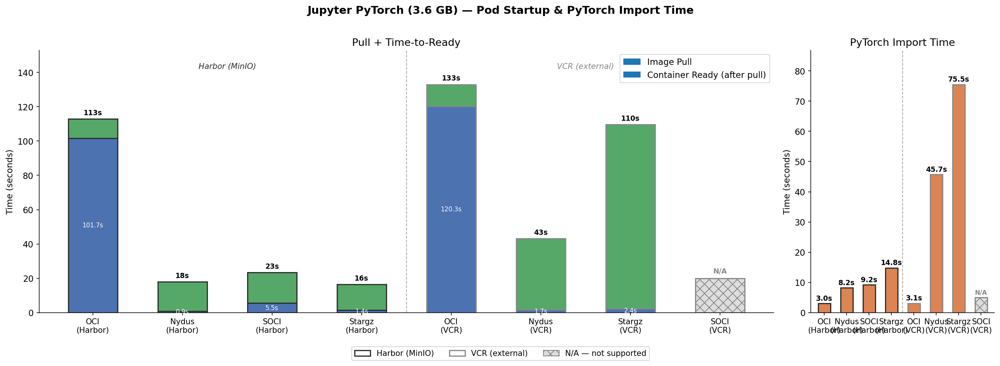
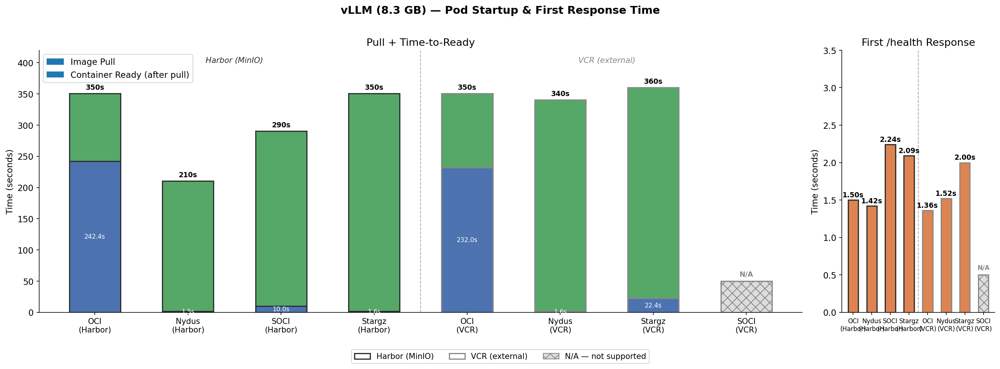

# Benchmark: Lazy Loading Container Images for AI/ML on Kubernetes

*Hoa Ngo · GreenNode · KubeCommunity 2026*

*Notes:* The talk has two halves — benchmark first, then how to actually run it in production.

---

## Outline

1. The cold-start problem
2. Three lazy-loading technologies
3. How a snapshotter reads / writes
4. Benchmark — Jupyter & vLLM, internal vs external registry
5. Deploying lazy loading in production

*Notes:* Tell them the shape of the talk. The pivot from "what to use" to "how to run it" comes after the benchmark.

---

## Why this matters

- AI/ML container images are large: vLLM **8.3 GB**, Jupyter+PyTorch **3.6 GB**
- Traditional OCI: pull the **entire** image before the container starts
- Cold starts of 100s+ stall autoscaling and leave GPUs idle
- Lazy loading starts the container from a **small metadata index** and fetches data chunks **on-demand**

*Notes:* This is the same framing as the report's overview. Set the problem before naming any technology.

---

## Three lazy-loading technologies

- **Nydus** — RAFS + FUSE, on-demand 4 MB chunks (Dragonfly project)
- **SOCI** — AWS Seekable OCI, zTOC index over existing layers, parallel fetch
- **Stargz** — Google eStargz, TOC-based, per-file granularity

All three need a snapshotter on the node and (for Nydus/Stargz) a one-time image conversion.

*Notes:* SOCI is appealing because it doesn't rebuild the image. The benchmark shows why that's not enough.

---

## How a file read flows through the stack

```
container reads /opt/conda/.../torch/__init__.py
    │
overlayfs       upperdir miss → fall through to lowerdir (FUSE)
    │
RAFS FUSE       kernel forwards to nydusd
    │
nydusd          image.boot lookup → chunk ID → cache miss
    │
HTTPS           GET harbor/.../<sha>.blob   (4 MB)
    │
cache           write to /var/lib/containerd-nydus/cache
    │
return          bytes flow back up — container never knows
```

First read: network. Subsequent reads: local cache. Cache survives pod restarts and shares across pods on the same node.

*Notes:* Walk it once top-to-bottom. Sets up why registry locality and chunk size matter when we hit the benchmark slides.

---

## Test environment

| | |
|---|---|
| Node spec | 8 vCPU / 16 GB / SSD / 10 Gbps |
| OS | Ubuntu 24.04, kernel 6.8, containerd |
| Images | `jupyter-pytorch-cuda-full:v1.9.2` (3.6 GB), `vllm-openai:v0.12.0` (8.3 GB) |
| Registries | Harbor + MinIO (internal) · Cloud registry |

Measured per run: image pull · time-to-ready · first app metric (`import torch` / first `/health`).

*Notes:* Registry locality is a deliberate variable — we want to know if lazy loading still helps when blobs are far away.

---

## Jupyter PyTorch (3.6 GB) — results



*Notes:* Harbor — OCI 113s, Nydus 17.9s, Stargz 16.4s, SOCI 23.4s. VCR — OCI 133s, Nydus 43s, Stargz 110s, SOCI N/A (VCR didn't expose the index format SOCI needs). `import torch` after ready: Nydus/Harbor 8s, Nydus/VCR 46s.

---

## vLLM (8.3 GB) — results



*Notes:* Harbor — OCI 350s, Nydus 210s, SOCI 290s, Stargz 350s. VCR — OCI 350s, Nydus 340s, Stargz 360s, SOCI N/A. First `/health` response 1.4–2.2s across all working configs. Smaller relative win on vLLM than on Jupyter — next slide explains why.

---

## Why vLLM gets a smaller win

- vLLM loads almost all Python libraries at startup → most chunks get fetched anyway
- Lazy loading degrades to **parallel fetch with smaller working set** for "import everything" workloads
- Nydus still saves **140s/node** (350s → 210s) — real, just not 6×
- SOCI 290s vs Stargz 350s on Harbor: larger chunk granularity → fewer round trips

*Notes:* Be honest with the audience. The report's key observations #1 and #2 land here.

---

## Registry can be a the bottleneck

- Nydus + Harbor (PyTorch import): **8s**
- Nydus + VCR (PyTorch import): **45s**
- Same image, same snapshotter — only the registry moved
- On-demand chunks = many small HTTPS GETs in the hot path; RTT × chunks = real seconds

- Oservation: Some hypervisor registry (gcp/aws) that thing might not happend. but you pay extra fee for thoughput. Still needed. 

*Notes:* This is the report's key observation #3. Push back on "use the public registry for now."

---

## Do we need help of the cloud provider?

Lazy loading needs **two node-level injections**:

```
containerd  →  snapshotter = "nydus"  + register proxy_plugins.nydus
kubelet     →  --image-service-endpoint=…/containerd-nydus-grpc.sock
```

- **Self-managed nodes** (custom image / cloud-init): you own both — straightforward
- **Managed K8s**: depends on what the provider exposes
  - Launch templates, node user-data, kubelet extra-args → workable (EKS/GKE-style)
  - Fully managed kubelet, no node bootstrap hook → blocked
    - Snapshotter must start **before kubelet**

**Audit your cloud's support before committing to a rollout.**

*Notes:* Real-world friction lives here, not in nydus itself. The pod-vs-systemd ordering is why it has to be a host service. Full unit file and config layout are in the repo — point, don't read.

---

## Image conversion: who runs it?

Lazy-loading images need a one-time format conversion. Two models:

- **Registry-side (server does it)**
  - Harbor with the nydusify plugin → push `:v1.0`, get `:v1.0-nydus` auto
  - Alibaba ACR / VolcEngine (ByteDance) → native nydus on-demand
  - AWS ECR → native SOCI (v2 default since 2026)
  - GCP Artifact Registry → GKE Image Streaming (their own, not SOCI)
- **Client-side (you do it in CI)**
  - A `nerdctl image convert --nydus` step in the build pipeline
  - Or a CronJob/webhook watching for new upstream tags
  - ~2–5 min per image, reused fleet-wide

Either way: workloads pin `<tag>-nydus`. Rollback = swap tag.

**Check if your registry supports server-side conversion before building your own.**

*Notes:* Server-side conversion is a registry feature, not a Kubernetes feature — same theme as the kubelet/containerd slide: how much your provider gives you decides how much glue you write.

---

## Recommendation & takeaways

**Pick Nydus** for AI/ML on Kubernetes today.

| | |
|---|---|
| Pod ready, Jupyter | 113s → **17.9s** (6.3×) |
| Pod ready, vLLM    | 350s → **210s** (1.7×) |

- **SOCI** if your image lacks a giant layer (torch + CUDA) — OCI-compliant, no rebuild.
- **Stargz** is the awkward middle child.
- **Registry locality is non-negotiable** — co-locate blobs with workers.
- **Run the snapshotter as systemd**, not as a Pod.
- **Audit your cloud** for kubelet/containerd injection + registry-side conversion.

Full report & repo: `github.com/cloud-guru/CNCF-HCM-2026` 

*Notes:* Combined verdict + takeaways. Keep up during Q&A.
